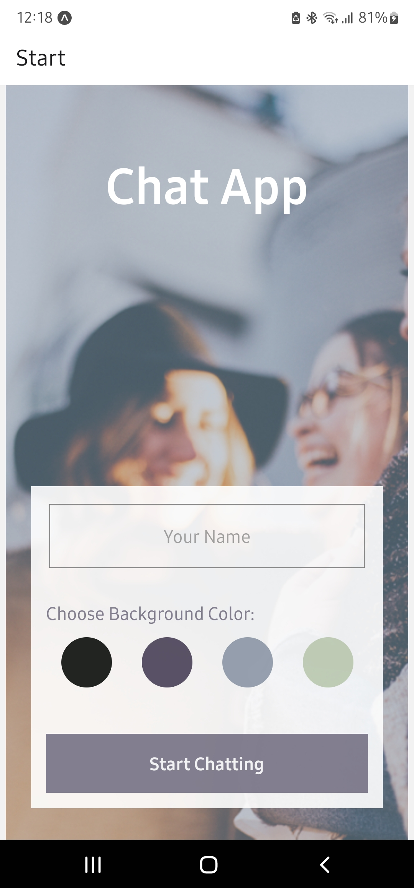
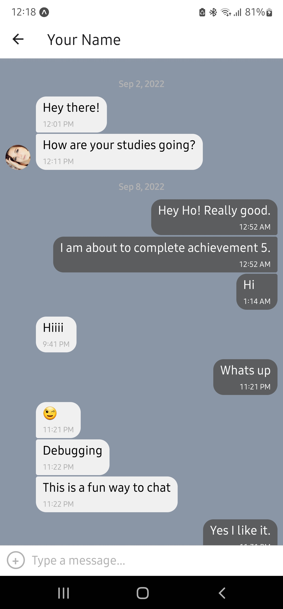

# Chat App


 

<br>

## Description

This application is a chat room where multiple users can join and share text messages, images, and their location.

<br>

## Key Features:
* A page where users can enter their name and choose a background color for the chat screen
before joining the chat.
* A page displaying the conversation, as well as an input field and a button to send.
* The chat must provide users with two additional communication features: sending images
and location data.
* Data gets stored online and offline.

<br>

## User Stories:

* As a new user, I want to be able to easily enter a chat room so I can quickly start talking to my
friends and family.
* As a user, I want to be able to send messages to my friends and family members to exchange
the latest news.
* As a user, I want to send images to my friends to show them what I’m currently doing.
* As a user, I want to share my location with my friends to show them where I am.
* As a user, I want to be able to read my messages offline so I can reread conversations at any
time.
* As a user with a visual impairment, I want to use a chat app that is compatible with a screen
reader so that I can engage with a chat interface.

<br>

## Installation & Configuration
### Expo
Expo provides tools that can help get you started and speeds up the app development. It has its own SDK(software development kit) which offers features that include access to the camera, retrieving geolocations and so on. 

1. To create new projects and start running Expo, you’ll need to install the Expo Command Line Interface (CLI) on your machine.
```
npm install expo-cli --g
```
2. Download Expo App to your device 
3. Signup for an Expo account
4. Go to your terminal, navigate to the repository and enter 
```
expo start
```
(be sure to configure your database and emulator prior to launching the demo)

<br>

### [Android Studio](https://developer.android.com/studio)
Android Studio creates virtual devices to allow testing and preview of the app on a android operating system.

* Android Studio Emulator <br>
   * For information to run the Android Emulator, [please click here for full instuctions](https://developer.android.com/studio/run/emulator). 
 
### [Google Firebase](https://firebase.google.com/)

Firebase is being used as a cloud-based storage platform for the app.

1. Sign in to Google Firebase and select **Add Project**, then set up your project.
2. Then select **Firebase Database** from the options on the left under **Build**.
3. Select **Start in Test Mode**, choose your region, then create a collection.
4. To set authentication, go to **Project Settings** and click **Register** to recieve the configuration code.
5. This code is required for your app in order to use the firebase as your data storage.
   * This code can be viewed in my chatscreen.js file.  

<br>

## Dependencies: 
* React-Native
* Expo
* Gifted Chat
* Google Firebase
* Android Studio - Emulator
